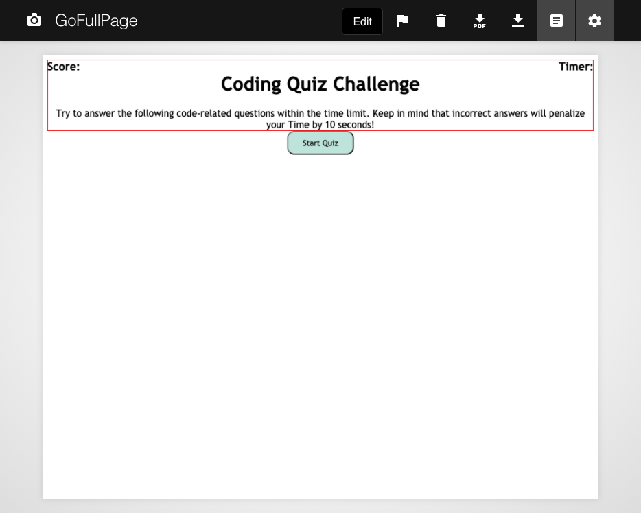

# Code-Quiz-Challenge

## [Code Quiz](https://josiemald.github.io/code-quiz/)

## [Repository](https://github.com/JosieMald/code-quiz.git)



### Project:
```
AS A coding boot camp student create a timed quiz on JavaScript fundamentals that stores high scores
so that I can gauge my progress compared to my peers.
```

### Description
```
created quiz that times your progress as you answer questions and keeps your score.
```